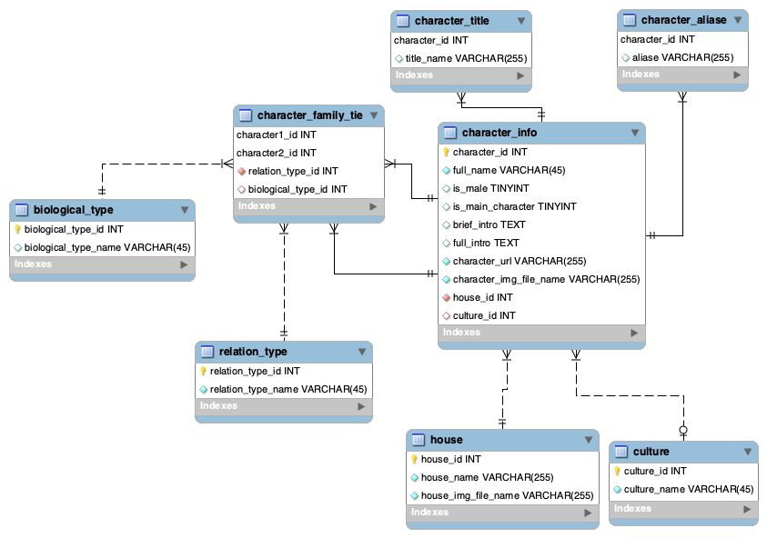

# A Wiki For Game of Throne

## Purpose

Being a fan of tv shows, I am interested in building a wiki-like Django application for one particular tv series. With the large number of characters, super complicated relationships, and especially the popularity, Game of Throne becomes the best choice. 

Although there already have some wiki or wikia pages of Game of Throne, the description for each character or event is so long that it’s hard for us to take away the main content of each character. So I would like to make a simpler and refiner version for it.

This website include two parts of information. 

1. character: for each character, in addition to the basic introduction, the page will also display a family tree. 

2. Houses: house introduction and people in this house.


The main challenge is how to correctly retrieve father, mother, siblings and son/daughter from database and generate the hierarchical family tree in the web page for each character. The character family ties dataset I already got only contains the father and mother information for each character. The solution of retrieving those information may involve the recursive database operation. What’s more, how to render a user friendly family tree graph with relationship  between characters is another challenge.

## Data source: 

data comes from:

https://gameofthrones.fandom.com/wiki/Game_of_Thrones_Wiki

https://www.hbo.com/game-of-thrones/cast-and-crew

https://github.com/mneedham/neo4j-got/tree/master/data/import

https://api.got.show/doc/

## Data model:



many to many relationship: 

1) characters and events 

2) the relationship between characters

## Package Dependencies

```
certifi==2018.10.15
chardet==3.0.4
defusedxml==0.5.0
Django==2.1.1
django-crispy-forms==1.7.2
django-test-without-migrations==0.6
idna==2.7
mysqlclient==1.3.13
oauthlib==2.1.0
PyJWT==1.6.4
python3-openid==3.1.0
pytz==2018.5
requests==2.20.0
requests-oauthlib==1.0.0
six==1.11.0
social-auth-app-django==3.0.0
social-auth-core==2.0.0
urllib3==1.24
```


